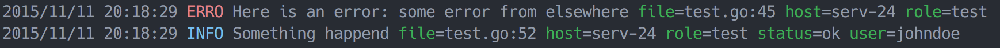

:warning: **Check [zerolog](https://github.com/rs/zerolog), the successor of xlog.**


# HTTP Handler Logger

[](https://godoc.org/github.com/rs/xlog) [](https://raw.githubusercontent.com/rs/xlog/master/LICENSE) [](https://travis-ci.org/rs/xlog) [](http://gocover.io/github.com/rs/xlog)

`xlog` is a logger for [net/context](https://godoc.org/golang.org/x/net/context) aware HTTP applications.

Unlike most loggers, `xlog` will never block your application because one its outputs is lagging. The log commands are connected to their outputs through a buffered channel and will prefer to discard messages if the buffer get full. All message formatting, serialization and transport happen in a dedicated go routine.

Read more about `xlog` on [Dailymotion engineering blog](http://engineering.dailymotion.com/our-way-to-go/).



## Features

- Per request log context
- Per request and/or per message key/value fields
- Log levels (Debug, Info, Warn, Error)
- Color output when terminal is detected
- Custom output (JSON, [logfmt](https://github.com/kr/logfmt), …)
- Automatic gathering of request context like User-Agent, IP etc.
- Drops message rather than blocking execution
- Easy access logging thru [github.com/rs/xaccess](https://github.com/rs/xaccess)

Works with both Go 1.7+ (with `net/context` support) and Go 1.6 if used with [github.com/rs/xhandler](https://github.com/rs/xhandler).

## Install

    go get github.com/rs/xlog

## Usage

```go
c := alice.New()

host, _ := os.Hostname()
conf := xlog.Config{
    // Log info level and higher
    Level: xlog.LevelInfo,
    // Set some global env fields
    Fields: xlog.F{
        "role": "my-service",
        "host": host,
    },
    // Output everything on console
    Output: xlog.NewOutputChannel(xlog.NewConsoleOutput()),
}

// Install the logger handler
c = c.Append(xlog.NewHandler(conf))

// Optionally plug the xlog handler's input to Go's default logger
log.SetFlags(0)
xlogger := xlog.New(conf)
log.SetOutput(xlogger)

// Install some provided extra handler to set some request's context fields.
// Thanks to those handler, all our logs will come with some pre-populated fields.
c = c.Append(xlog.MethodHandler("method"))
c = c.Append(xlog.URLHandler("url"))
c = c.Append(xlog.RemoteAddrHandler("ip"))
c = c.Append(xlog.UserAgentHandler("user_agent"))
c = c.Append(xlog.RefererHandler("referer"))
c = c.Append(xlog.RequestIDHandler("req_id", "Request-Id"))

// Here is your final handler
h := c.Then(http.HandlerFunc(func(w http.ResponseWriter, r *http.Request) {
    // Get the logger from the request's context. You can safely assume it
    // will be always there: if the handler is removed, xlog.FromContext
    // will return a NopLogger
    l := xlog.FromRequest(r)

    // Then log some errors
    if err := errors.New("some error from elsewhere"); err != nil {
        l.Errorf("Here is an error: %v", err)
    }

    // Or some info with fields
    l.Info("Something happend", xlog.F{
        "user":   "current user id",
        "status": "ok",
    })
    // Output:
    // {
    //   "message": "Something happend",
    //   "level": "info",
    //   "file": "main.go:34",
    //   "time": time.Time{...},
    //   "user": "current user id",
    //   "status": "ok",
    //   "ip": "1.2.3.4",
    //   "user-agent": "Mozilla/1.2.3...",
    //   "referer": "http://somewhere.com/path",
    //   "role": "my-service",
    //   "host": "somehost"
    // }
}))
http.Handle("/", h)

if err := http.ListenAndServe(":8080", nil); err != nil {
    xlogger.Fatal(err)
}
```

### Copy Logger

You may want to get a copy of the current logger to pass a modified version to a function without touching the original:

```go
l := xlog.FromContext(ctx)
l2 := xlog.Copy(l)
l2.SetField("foo", "bar")
```

Make sure you copy a request context logger if you plan to use it in a go routine that may still exist after the end of the current request. Contextual loggers are reused after each requests to lower the pressure on the garbage collector. If you would use such a logger in a go routine, you may end up using a logger from another request/context or worse, a nil pointer:

```go
l := xlog.FromContext(ctx)
l2 := xlog.Copy(l)
go func() {
    // use the safe copy
    l2.Info("something")
}()
```

### Global Logger

You may use the standard Go logger and plug `xlog` as it's output as `xlog` implements `io.Writer`:

```go
xlogger := xlog.New(conf)
log.SetOutput(xlogger)
```

This has the advantage to make all your existing code or libraries already using Go's standard logger to use `xlog` with no change. The drawback though, is that you won't have control on the logging level and won't be able to add custom fields (other than ones set on the logger itself via configuration or `SetFields()`) for those messages.

Another option for code you manage but which is outside of a HTTP request handler is to use the `xlog` provided default logger:

```go
xlog.Debugf("some message with %s", variable, xlog.F{"and": "field support"})
```

This way you have access to all the possibilities offered by `xlog` without having to carry the logger instance around. The default global logger has no fields set and has its output set to the console with no buffering channel. You may want to change that using the `xlog.SetLogger()` method:

```go
xlog.SetLogger(xlog.New(xlog.Config{
    Level: xlog.LevelInfo,
    Output: xlog.NewConsoleOutput(),
    Fields: xlog.F{
        "role": "my-service",
    },
}))
```

### Configure Output

By default, output is setup to output debug and info message on `STDOUT` and warning and errors to `STDERR`. You can easily change this setup.

XLog output can be customized using composable output handlers. Thanks to the [LevelOutput](https://godoc.org/github.com/rs/xlog#LevelOutput), [MultiOutput](https://godoc.org/github.com/rs/xlog#MultiOutput) and [FilterOutput](https://godoc.org/github.com/rs/xlog#FilterOutput), it is easy to route messages precisely.

```go
conf := xlog.Config{
    Output: xlog.NewOutputChannel(xlog.MultiOutput{
        // Send all logs with field type=mymodule to a remote syslog
        0: xlog.FilterOutput{
            Cond: func(fields map[string]interface{}) bool {
                return fields["type"] == "mymodule"
            },
            Output: xlog.NewSyslogOutput("tcp", "1.2.3.4:1234", "mymodule"),
        },
        // Setup different output per log level
        1: xlog.LevelOutput{
            // Send errors to the console
            Error: xlog.NewConsoleOutput(),
            // Send syslog output for error level
            Info: xlog.NewSyslogOutput("", "", ""),
        },
    }),
})

h = xlog.NewHandler(conf)
```

#### Built-in Output Modules

| Name | Description |
|------|-------------|
| [OutputChannel](https://godoc.org/github.com/rs/xlog#OutputChannel) | Buffers messages before sending. This output should always be the output directly set to xlog's configuration.
| [MultiOutput](https://godoc.org/github.com/rs/xlog#MultiOutput) | Routes the same message to several outputs. If one or more outputs return error, the last error is returned.
| [FilterOutput](https://godoc.org/github.com/rs/xlog#FilterOutput) | Tests a condition on the message and forward it to the child output if true.
| [LevelOutput](https://godoc.org/github.com/rs/xlog#LevelOutput) | Routes messages per level outputs.
| [ConsoleOutput](https://godoc.org/github.com/rs/xlog#NewConsoleOutput) | Prints messages in a human readable form on the stdout with color when supported. Fallback to logfmt output if the stdout isn't a terminal.
| [JSONOutput](https://godoc.org/github.com/rs/xlog#NewJSONOutput) | Serialize messages in JSON.
| [LogfmtOutput](https://godoc.org/github.com/rs/xlog#NewLogfmtOutput) | Serialize messages using Heroku like [logfmt](https://github.com/kr/logfmt).
| [LogstashOutput](https://godoc.org/github.com/rs/xlog#NewLogstashOutput) | Serialize JSON message using Logstash 2.0 (schema v1) structured format.
| [SyslogOutput](https://godoc.org/github.com/rs/xlog#NewSyslogOutput) | Send messages to syslog.
| [UIDOutput](https://godoc.org/github.com/rs/xlog#NewUIDOutput) | Append a globally unique id to every message and forward it to the next output.

## Third Party Extensions

| Project | Author | Description |
|---------|--------|-------------|
| [gRPClog](https://github.com/clawio/grpcxlog) | [Hugo González Labrador](https://github.com/labkode) | An adapter to use xlog as the logger for grpclog.
| [xlog-nsq](https://github.com/rs/xlog-nsq) | [Olivier Poitrey](https://github.com/rs) | An xlog to [NSQ](http://nsq.io) output.
| [xlog-sentry](https://github.com/trong/xlog-sentry) | [trong](https://github.com/trong) | An xlog to [Sentry](https://getsentry.com/) output.

## Licenses

All source code is licensed under the [MIT License](https://raw.github.com/rs/xlog/master/LICENSE).
